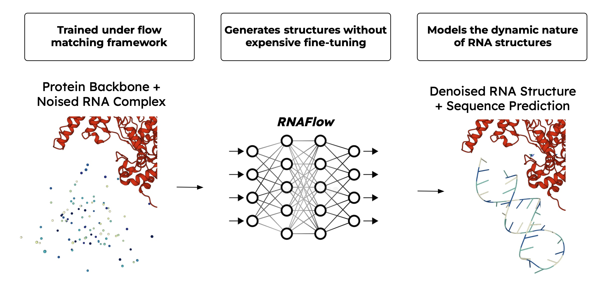

## RNAFlow: RNA Structure & Sequence Design via Inverse Folding-Based Flow Matching ##

RNAFlow is a flow matching model for protein-conditioned RNA sequence-structure design. Its denoising network integrates an RNA inverse folding model and a pre-trained RosettaFold2NA network for generation of RNA sequences and structures.

<p align="center">
    
</p>

### Running Inference ###

To generate the necessary files to run RF2NA during the inference process, run the following commands from the main directory:

```
python rnaflow/data/process_data.py  --dataset rnaflow/data/rf2na_dataset.pickle --full_process False
```
```
python rnaflow/data/process_data.py  --dataset rnaflow/data/seq_sim_dataset.pickle --full_process False
```

This will create a folder called ```rnaflow/data/rf_data``` containing the necessary files to fold sequences with RF2NA. Then run the following command from the main directory:

```
python scripts/inference_rnaflow.py
```

The script will print RMSD and sequence recovery for each generated sample. PDBs for the final complex and each structure in the trajectory will also be saved.

### Processing Dataset ###

Pre-processed datasets for both splits are given at ```rnaflow/data/rf2na_dataset.pickle``` and ```rnaflow/data/seq_sim_dataset.pickle```

To preprocess the dataset on your own, run the following command from the main directory:

```
python rnaflow/data/process_data.py --pdbbind_csv rnaflow/data/pdbbind_na.csv \
    --pdb_out_dir rnaflow/data/pdbs \
    --rf2na_test_csv rnaflow/data/rf2na_test_val_set.csv \
    --dataset rnaflow/data/rf2na_dataset.pickle \
    --full_process True
```

### Running Train ###

To retrain RNAFlow, get RF2NA weights from https://files.ipd.uw.edu/dimaio/RF2NA_apr23.tgz and save to ```RoseTTAFold2NA/network/weights/RF2NA_apr23.pt```. To generate the necessary files to run RF2NA during the training process, run the following commands from the main directory:

```
python rnaflow/data/process_data.py  --dataset rnaflow/data/rf2na_dataset.pickle --full_process False
```
```
python rnaflow/data/process_data.py  --dataset rnaflow/data/seq_sim_dataset.pickle --full_process False
```

This will create a folder called ```rnaflow/data/rf_data``` containing the necessary files to fold sequences with RF2NA. Then run the following command from the main directory:

```
python scripts/train_rnaflow.py
```
